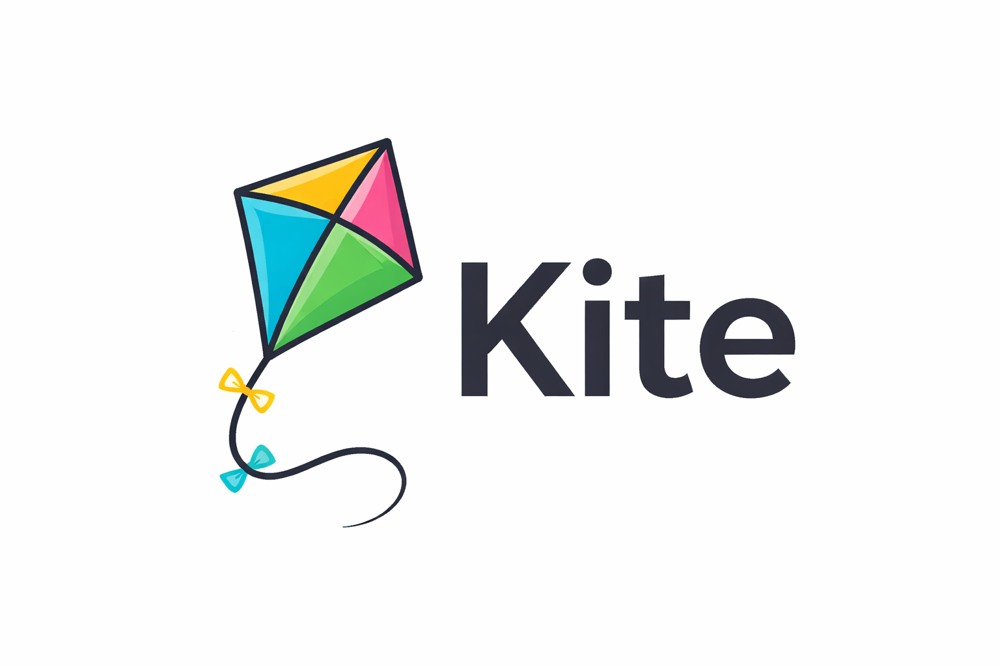

# Kite



**Kite** is a small toy programming language built to understand how a simple interpreter works.

It was designed as a minimal scripting language with:

- A hand-written lexer
- A recursive descent parser
- An AST-based interpreter
- Basic control flow
- Arrays and string support
- File I/O builtins

Kite is not meant to compete with production languages.  
It exists to explore language design, parsing, evaluation, and runtime architecture in a clear and controlled way.

---

## Example

```kite
r = read_file("example.txt")

if r[0]
    print(r[1])
else
    print(r[1])
end


My name is Alejandro Caballero Salas and I'm the author of this small and humble project